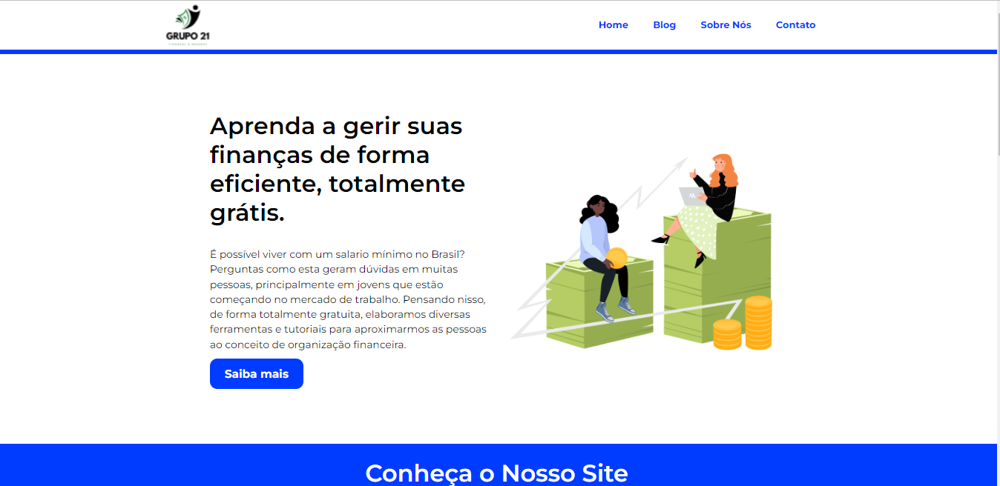

# Educação Financeira - Hackton

Esse site lhe mostrará de como a educação financeira é importante para você e para a sociedade, e vai te dar dicas de como cuidar de sua saúde financeira.
Acesse o link: https://educacaofinanceira-hackton.netlify.app

## 🚀 Technologies

- [HTML]
- [CSS]
- [VS Code][vscode] with [EditorConfig][vceditconfig] and [ESLint][vceslint]
- [JavaScript]

## 📝 License

Esse projeto esta sobre a licença MIT

## 📝 Desenvolvedores:
<a href="https://github.com/Lapet6" target="_blank"> <i class="fa-brands fa-github"></i> Guilherme Barreiros</a> 
                    <a href="https://github.com/samuelsilvati" target="_blank"><i class="fa-brands fa-github"></i> Samuel Silva</a> 
                    <a href="https://github.com/joaoassc" target="_blank"><i class="fa-brands fa-github"></i> João Soares</a> 
                    <a href="https://github.com/25ribeiro" target="_blank"><i class="fa-brands fa-github"></i> João Ribeiro</a> 
                    <a href="https://github.com/Itor-Carlos" target="_blank"><i class="fa-brands fa-github"></i> Itor Queiroz</a> 
